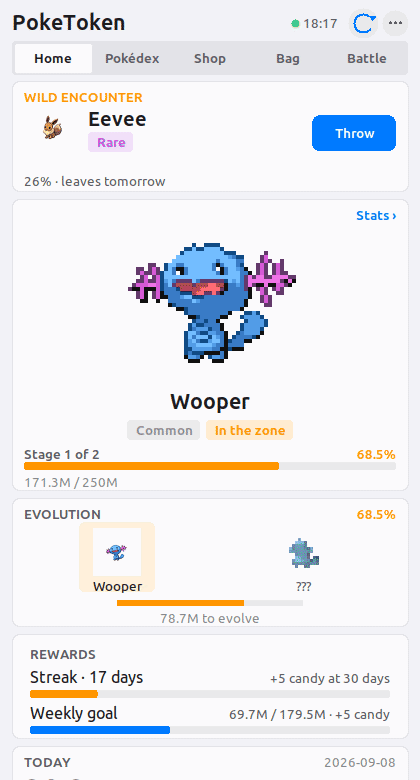

# PokeToken


**Turn your Claude Code usage into a Pokémon companion.**

PokeToken is a local-first Pokémon progression game powered by the tokens you actually use in Claude Code.

Code as usual. Your companion grows. Evolve it, fill your Pokédex, encounter wild Pokémon, earn rewards, and spend the tokens you've used in the in-game shop.

**Windows / WSL · Linux · Desktop + CLI · Local-first**

> Inspired by and originally ported from [PokeTokenBar](https://github.com/chattymin/PokeTokenBar), the macOS project by chattymin. PokeToken expands the idea into a cross-platform desktop/CLI game with its own progression, collection and reward systems.

<p align="center">
  
</p>

<p align="center">
  
  
  
</p>

> **Unofficial, non-commercial Pokémon fan project.**  
> Pokémon species data and sprites are retrieved from [PokéAPI](https://pokeapi.co/) at runtime and are not bundled with PokeToken.

---

## How it works

Your real Claude Code usage becomes the game's progression and economy.

```text
Claude Code
     │
     ▼
   Tokens
     │
     ├──────────────► Companion growth
     │                     │
     │                     ▼
     │                  Evolution
     │
     ├──────────────► Shop & items
     │
     ├──────────────► Rewards & streaks
     │
     └──────────────► Wild encounters
                           │
                           ▼
                        Pokédex
```

There are no artificial steps to grind.

**Use Claude Code. PokeToken grows alongside you.**

---

## Quick start

### Requirements

- Python 3.10+
- Pillow
- Tk
- Claude Code usage history

Clone and install:

```bash
git clone https://github.com/haghfizzuddin/poketoken-desktop
cd poketoken-desktop
pip install --user .
poketoken app
```

If Pillow is missing:

```bash
pip install --user pillow
```

On Ubuntu/WSL, if Tk is missing:

```bash
sudo apt install python3-tk
```

You can also use the included installer:

```bash
scripts/install.sh
poketoken app
```

Nothing is installed system-wide.

### Windows / WSL

`scripts/windows/PokeToken.vbs` opens or closes PokeToken without leaving a console window behind.

Create a shortcut to it and pin it to Start or the taskbar.

WSL2 requires WSLg.

### Linux

A desktop entry is included:

```text
scripts/linux/poketoken.desktop
```

Copy it to:

```text
~/.local/share/applications/
```

---

## What you can do

### Raise a companion

Every assistant turn in your local Claude Code logs contributes its token usage.

Your Pokémon grows from **Lv 5 → Lv 100** as you code.

Progress persists between sessions, shutdowns and reboots.

### Hatch Pokémon

A new egg starts hatching after **5M tokens**.

Eggs can hatch into Gen 1–5 base-form Pokémon, weighted by their capture rate.

That means common Pokémon are actually common, while rare Pokémon feel rare.

Every hatch also rolls:

- one of 25 natures
- six hidden IVs
- a 1/64 base shiny chance
- its actual PokéAPI evolution line

And occasionally, something may not be quite what it seems.

### Evolve

Your companion follows its real evolution chain.

Evolution cost depends on rarity:

| Rarity | Total progression |
|---|---:|
| Common | 750M |
| Uncommon | 1.875B |
| Rare | 3B |
| Legendary | 6B |

One-stage, two-stage and three-stage evolution lines share the same total progression for their rarity.

Future forms remain obscured until you approach their evolution threshold.

### Build your Pokédex

Once a Pokémon reaches its final form and graduation threshold, it becomes a permanent Pokédex record.

Your next egg then begins.

Pokémon you caught or stopped raising can also be raised later, while graduated Pokémon remain finished trophies.

### Encounter wild Pokémon

Wild Pokémon can appear when you:

- maintain a streak; or
- beat your personal-best 5-hour usage block.

Wild encounters draw from all available species rather than only hatchable base forms.

Already-owned species are less likely to appear, and the same species cannot appear twice consecutively.

Catch it before it leaves.

### Earn rewards

PokeToken rewards consistency rather than simply encouraging you to burn more tokens.

A day counts toward your streak after **1M+ tokens**.

Streak milestones award Rare Candy:

| Streak | Reward |
|---:|---:|
| 3 days | 1 Candy |
| 7 days | 2 Candy |
| 14 days | 3 Candy |
| 30 days | 5 Candy |

Further 30-day milestones award another 5.

Your weekly goal adapts to your own previous usage, with a 50M floor. Beat it and you earn **5 Rare Candies**.

### Spend your tokens

The tokens you've used also become your wallet.

Spend them on:

- **Poké Ball** — catch a wild Pokémon
- **Mint** — re-roll your companion's nature
- **Great Ball** — improved catch chance
- **Ultra Ball** — further improved catch chance
- **Rare Candy** — +100M companion growth
- **Pokémon Egg** — start over with a new companion
- **Uncommon Egg** — guaranteed Uncommon or better
- **Rare Egg** — guaranteed Rare or better
- **Shiny Charm** — permanently improves shiny odds

Your Claude bill may hurt.

At least now you get Pokémon for it.

---

## Your habits affect your Pokémon

PokeToken isn't designed to reward raw token consumption alone.

Each hatch rolls six hidden IVs from **0–31**, but consistent and efficient usage can earn additional best-of rolls during incubation.

Examples include:

- 7-day streak
- 14-day streak
- strong cache-read efficiency

A 7-day streak also improves shiny odds.

Rarity odds remain untouched.

**More tokens progress your Pokémon. Better habits improve the Pokémon you raise.**

---

## Stats

Pokémon stats use the games' stat formulas, including nature modifiers.

Each Pokémon has:

```text
HP
Attack
Defense
Special Attack
Special Defense
Speed
```

Level follows progression toward graduation:

```text
Lv 5 → Lv 100
```

Species, IVs, nature and level all contribute to the final Pokémon.

---

## Buddy Pokémon

Any Pokémon already in your Pokédex can become your displayed buddy.

From its species page:

```text
Set as buddy
```

or:

```bash
poketoken buddy <name>
```

Your buddy is only a display choice.

The Pokémon you're currently raising continues progressing underneath.

Clear it with:

```bash
poketoken buddy --clear
```

---

## Raise a Pokémon again

A Pokémon you've caught or previously stopped raising can be brought back out of the Pokédex.

```bash
poketoken raise <name> --yes
```

It keeps its:

- IVs
- nature
- shininess

but starts its training again from Lv 5 with zero growth.

Choosing a specific Pokémon to raise costs one plain egg.

Graduated Pokémon cannot be raised again.

---

## Desktop + terminal

PokeToken doesn't require the desktop window.

### Desktop

```bash
poketoken app
```

### Current status

```bash
poketoken status
```

### Live terminal view

```bash
poketoken watch -i 30
```

### Claude Code status line

```bash
poketoken statusline
```

Example:

```text
⚡ Pikachu 2/3 41% │ 12.3M $4.1 │ 85.2K/min
```

Add the output to your Claude Code status-line script and your companion can live directly in Claude Code's footer.

Every status-line call also acts as a refresh tick.

---

## Commands

| Command | What it does |
|---|---|
| `poketoken app` | Open the desktop app |
| `poketoken app --fg` | Run the window attached to the terminal |
| `poketoken close` | Close the running window |
| `poketoken toggle` | Open PokeToken, or close it if already open |
| `poketoken pet` | Compact companion-only view |
| `poketoken status` | One-shot terminal status |
| `poketoken watch -i 30` | Live terminal view |
| `poketoken statusline` | Compact Claude Code status line |
| `poketoken refresh` | Run one refresh tick |
| `poketoken dex` | View the Pokédex |
| `poketoken shop` | View/buy shop items |
| `poketoken bag` | View/use inventory |
| `poketoken stats` | Pokémon stats, IVs and luck |
| `poketoken buddy [name\|#id]` | Set an owned Pokémon as buddy |
| `poketoken raise <name\|#id> --yes` | Raise an owned Pokémon |
| `poketoken history -n 30` | Daily usage/streak history |
| `poketoken notify on\|off\|test\|status` | Desktop notifications |
| `poketoken timer on\|off\|status` | Background refresh timer |
| `poketoken autostart on\|off\|status` | Launch at sign-in |
| `poketoken export [path]` | Export your save |
| `poketoken import <file>` | Import a save |
| `poketoken debug` | Show scan roots, timings and raw state |

Run:

```bash
poketoken --help
```

for the complete command reference.

---

## Keep PokeToken running

Progress is credited during refresh ticks.

Ticks happen when:

- the desktop app is running
- the status line runs
- a CLI command runs
- the background timer runs

To keep progression updated while the window is closed:

```bash
poketoken timer on
```

Check it with:

```bash
poketoken timer status
```

To automatically open PokeToken when you sign in:

```bash
poketoken autostart on
```

On WSL/Linux, the timer uses a systemd user timer when available and falls back to providing a crontab command when it isn't.

---

## Move your save

Export:

```bash
poketoken export
```

Or choose a destination:

```bash
poketoken export ~/backups/
```

Import into an empty PokeToken state:

```bash
poketoken import poketoken-save-2026-09-08.json
```

Replace an existing save:

```bash
poketoken import poketoken-save-2026-09-08.json --replace
```

PokeToken backs up the existing state before replacement and verifies that the imported save can be loaded.

Close the desktop app before importing:

```bash
poketoken close
```

---

## Local-first

PokeToken is designed to stay on your machine.

It reads token usage from your local Claude Code data:

```text
~/.claude/projects/**/*.jsonl
```

PokeToken extracts the usage information needed to drive progression.

Your game state is stored locally as JSON.

**PokeToken does not require:**

- a PokeToken account
- an Anthropic API key
- a PokeToken server

The application contacts **PokéAPI** to retrieve Pokémon species data and sprites.

No PokeToken backend is required for normal gameplay.

> If you're reviewing the project from a security perspective, the source is here for exactly that reason. Issues and reports are welcome.

---

## How token tracking works

Claude Code records token usage inside local project JSONL files.

PokeToken scans those logs incrementally rather than repeatedly processing the entire history.

Streamed messages are deduplicated using:

```text
(message.id, requestId)
```

with the largest observed total retained.

Only usage after PokeToken's installation baseline contributes to progression and the wallet.

This means historical Claude usage does not instantly hatch or graduate Pokémon when PokeToken is first installed.

---

## Responsive desktop UI

PokeToken adapts from compact companion-sized windows to full desktop layouts.

The interface uses four broad responsive ranges:

```text
<480px       compact
480–767px    single column
768–1199px   two column
1200px+      full desktop
```

The full layout is capped and centred rather than stretching indefinitely across large displays.

On narrow windows:

- companion artwork scales down
- secondary telemetry collapses
- cards reflow
- navigation remains accessible
- Shop and Pokédex adapt to the available width

On larger windows, detailed token telemetry and game information can use the additional space.

---

## Experimental: Battle cards

> Battle is currently a casual, trust-based feature. The multiplayer/battle system may change in future releases.

PokeToken can export your Pokémon as a portable `PT1.…` battle card:

```bash
poketoken card --trainer NAME
```

Send the card to another PokeToken user:

```bash
poketoken battle <card>
```

Both clients can reproduce the same deterministic fight using species stats, IVs, nature and type matchups.

Battles are **flat Lv 50 by default**, so the result isn't simply determined by who has burned more Claude tokens.

Raw-level battles are also available:

```bash
poketoken battle <card> --raw
```

The current system is asynchronous and local. There is no matchmaking server or real-time multiplayer backend.

Future battle development is intentionally separate from the core progression game.

---

## Game philosophy

PokeToken is meant to make something developers already do a little more fun.

It deliberately avoids turning token consumption itself into the objective.

Raw usage progresses your companion.

Consistency can improve its potential.

Efficiency can improve its potential.

But rarity is still luck.

You shouldn't burn 100M unnecessary tokens because you want a better Pokémon.

**Go build something instead.**

---

## Inspiration

PokeToken started as a Python port of [PokeTokenBar](https://github.com/chattymin/PokeTokenBar), which brought the idea of turning AI coding-token usage into Pokémon progression to macOS.

I wanted the same idea available outside macOS and began extending it into a broader desktop/CLI companion game for Claude Code.

Huge credit to the original project for the concept.

---

## Contributing

Issues, bug reports and pull requests are welcome.

Especially useful:

- Windows / WSL compatibility reports
- Linux distribution compatibility
- UI scaling issues
- unusual Claude Code log formats
- progression/economy feedback
- accessibility issues
- performance problems
- security reports

If something breaks, please include:

```bash
poketoken debug
```

output where appropriate, **after checking it for anything you don't want to share publicly**.

Please do not include Claude prompts, source code or other private project data in public issues.

---

## License & disclaimer

PokeToken is an unofficial, non-commercial fan project.

Pokémon and Pokémon character names are trademarks of Nintendo / Creatures Inc. / GAME FREAK inc. This project is not affiliated with, endorsed by or sponsored by Nintendo, Creatures Inc., GAME FREAK, The Pokémon Company, Anthropic or PokéAPI.

Pokémon sprites and species data are retrieved from [PokéAPI](https://pokeapi.co/) at runtime and are not bundled with this repository.

The repository's software license applies to PokeToken's own source code and does not grant rights to third-party Pokémon intellectual property or assets.

See [LICENSE](LICENSE) for the software license.
