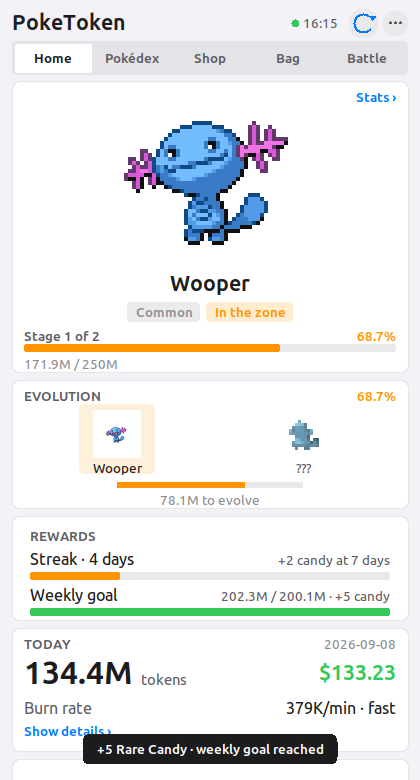
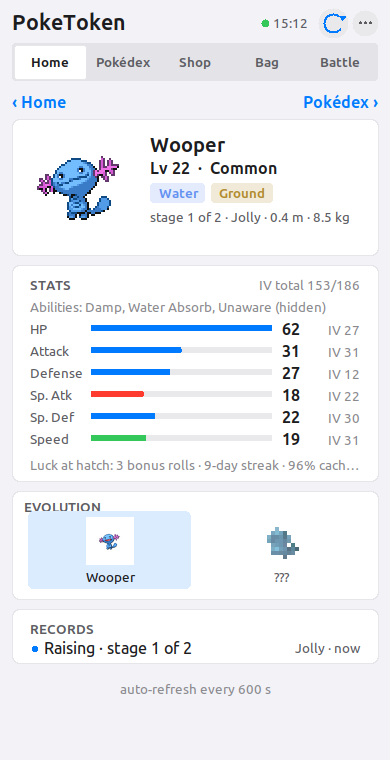
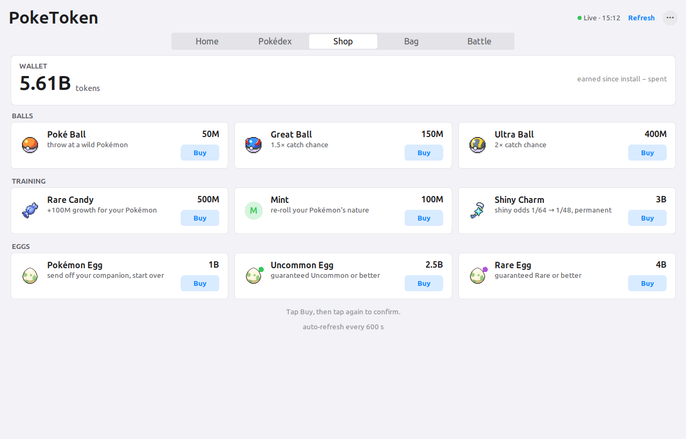
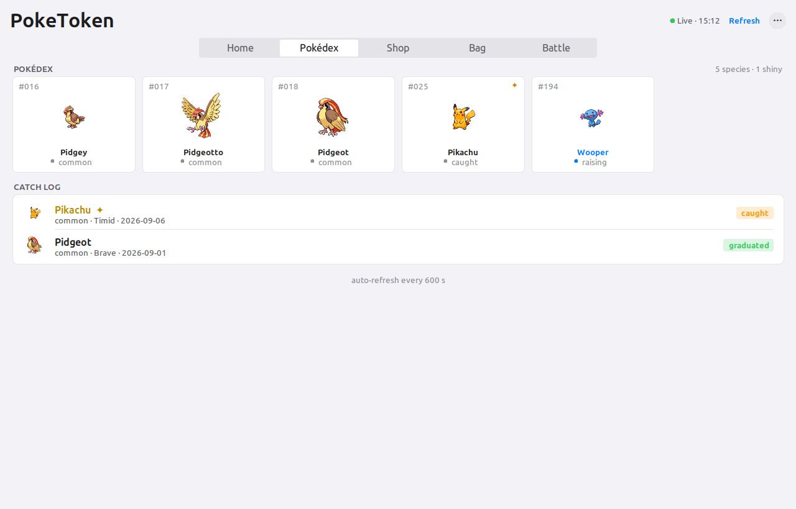

# poketoken-desktop

**Your Claude Code tokens, hatched into Pokémon — for WSL, Linux and Windows.**

A Python port of [PokeTokenBar](https://github.com/chattymin/PokeTokenBar) (macOS only) that
reads your local Claude Code logs, raises a Pokémon companion from the tokens you burn, and
shows it in a live, SwiftUI-styled window or in the terminal. Spend tokens, hatch an egg,
evolve it through its real evolution line, graduate it into your Pokédex, start again.

<p align="center">
  
  
  
  
</p>

> Unofficial, non-commercial Pokémon fan project. Sprites and species data come from
> [PokéAPI](https://pokeapi.co/) at runtime and are not bundled. See [License](#license--disclaimer).

## How it works

1. **Code as usual.** Every `assistant` turn in `~/.claude/projects/**/*.jsonl` carries token
   usage. poketoken reads those files (append-only, so refreshes are incremental) and dedups
   streamed messages on `(message.id, requestId)` keeping the largest total, like upstream.
2. **Hatch.** 5M tokens incubate an egg. The species is drawn from every Gen 1–5 base form,
   weighted by capture rate (commons often, a legendary about 1 in 129). One of 25 natures;
   1/64 shiny.
3. **Evolve.** It grows through its real PokéAPI evolution chain (1/2/3 stages, branching).
   A line always costs the same total for its rarity: 750M (common), 1.875B (uncommon),
   3B (rare), 6B (legendary) tokens.
4. **Graduate.** Final form + threshold archives it in the Pokédex and a fresh egg arrives.
5. **Shop & Bag.** Tokens you have used are your currency: Rare Candy (+100M growth), a Mint
   (re-roll nature), a Shiny Charm (1/64 → 1/48), or a new egg — plain, Uncommon+ or Rare+.
6. **Streaks and the weekly goal earn Rare Candy.** A day counts at 1M+ tokens. Streak
   milestones of 3 / 7 / 14 / 30 days pay 1 / 2 / 3 / 5 candies (then 5 per further 30 days);
   beating your weekly goal — the median of your previous weeks, floor 50M — pays 5. This
   replaces upstream's rate-limit grants and rewards showing up, not burning.
7. **Stats, IVs and luck.** Every hatch rolls six hidden IVs (0–31). Consistency and efficiency
   during incubation add best-of bonus rolls: a 7- and 14-day streak, a 7-day cache-read ratio
   of 70 % and 90 %. A 7-day streak also cuts the shiny denominator by a quarter. Rarity odds
   are never touched, so raw volume buys nothing. Level 5→100 follows growth toward
   graduation and stats use the games' formula with the nature's ±10 %.
8. **Ditto.** 1 in 128 common multi-stage hatches is a Ditto in disguise; it drops the act at
   the first evolution threshold. Its shininess stays hidden until then.
9. **Battle cards.** `poketoken card` prints a short `PT1.…` token; a colleague runs
   `poketoken battle <token>` and both of you get the same deterministic fight — real type
   matchups, STAB, physical or special by the better stat. Trust-based and for fun.

Only tokens used *after* install count. Progress lives in a JSON save on disk, so closing the
window, shutting down WSL or rebooting loses nothing.

## Install

Python 3.10+, Pillow and Tk. On WSL2 you need WSLg (Windows 11, or Windows 10 22H2+).

```bash
git clone https://github.com/haghfizzuddin/poketoken-desktop
cd poketoken-desktop
pip install --user pillow          # if missing;  sudo apt install python3-tk  if Tk is missing
scripts/install.sh                 # puts `poketoken` in ~/.local/bin
poketoken app
```

Or `pip install --user .` for a proper `poketoken` console script. Nothing is installed
system-wide and nothing phones home except PokéAPI for sprites and species data.

**Windows shortcut:** `scripts/windows/PokeToken.vbs` opens or closes the window from Windows
with no console flash. Create a shortcut to it and pin it to the taskbar or Start.
**Linux desktop entry:** copy `scripts/linux/poketoken.desktop` to `~/.local/share/applications/`.

## Commands

| command | what |
|---|---|
| `poketoken app` | open the live window in the background and return to the shell (a second call brings it to front) |
| `poketoken app --fg` | the same, but attached to the terminal (errors print there instead of `app.log`) |
| `poketoken close` | close the running window |
| `poketoken toggle` | open in the background, or close if it is open — what the shortcuts use |
| `poketoken pet` | the same window in its compact, companion-only view |
| `poketoken status` | one-shot status card in the terminal (also the default) |
| `poketoken watch -i 30` | live terminal view |
| `poketoken statusline` | one compact line for the Claude Code status line |
| `poketoken refresh` | a single refresh tick (cron / systemd timers) |
| `poketoken dex` · `shop` · `bag` | Pokédex, token shop (`--buy candy\|mint\|charm\|egg\|egg-uncommon\|egg-rare`), inventory (`--use candy\|mint`) |
| `poketoken stats` | level, types, abilities, the six stats with IVs, and the luck behind them |
| `poketoken history -n 30` | daily usage table with the streak marker, streak and weekly goal |
| `poketoken card [--trainer NAME]` | your battle card as a shareable token (`--json` for the raw card) |
| `poketoken battle <card> [other]` | fight your Pokémon against a card, or spectate two cards |
| `poketoken notify on\|off\|test\|status` | desktop notifications for hatch / evolve / graduate / candy / egg |
| `poketoken timer on\|off\|status` | systemd user timer that runs `refresh` every 15 minutes while the window is closed (WSL, Linux) |
| `poketoken autostart on\|off\|status` | open the window at sign-in: Windows Startup folder (WSL, Windows) or XDG autostart (Linux) |
| `poketoken export [path]` | write the save to a portable JSON file (default `./poketoken-save-YYYY-MM-DD.json`) |
| `poketoken import <file> [--replace]` | install an exported save; `--replace` overwrites the current one after backing it up |
| `poketoken debug` | scan roots, timings, raw save |

Window flags: `--dark` / `--light`, `--compact`, `-i SECONDS` (refresh, default 30).
Keys: `Esc` / `Ctrl-W` close, `Ctrl-R` refresh, right-click or `⋯` for the menu (appearance,
compact view, sprite size, notifications). Sprites fill a fixed container — 256 (default), 320,
384 or 448 px — scaled by the largest whole number that fits, so a Pikachu looks as big as a
Venusaur; at 256 the companion, its evolution line and today's usage all fit the first screen,
and larger sizes widen the window. Shop and Bag buttons arm on the first click and fire on the
second, so a stray click never spends tokens. Click the companion on Home, or any Pokédex cell,
for that species' page: mini sprite and identity, the stats card (level, types, abilities, six
stats with IVs and the luck behind them; graduated records show their stats at Lv 100), the
evolution line and records. "‹ Home" / "‹ Pokédex" go back; "Pokédex ›" opens the board.
Future forms in the evolution line are shown blurred and sharpen as you approach the threshold.

**Battle tab.** Your card — name, level, types, the six stats and a power score — with a
*Copy card* button that puts the `PT1.…` token on the clipboard. Paste a colleague's token into
the *Challenger* field (or *Paste* it from the clipboard; a bad card says why inline) and press
*Battle!*: the same deterministic fight as `poketoken battle`, played out in an arena where both
sprites face off and the HP bars drain hit by hit (tap the arena to skip to the end), with the
log underneath and a banner for the result, turns and power. The *Record* card keeps your win and
loss count and the last ten fights in `battles.json`, outside the game save.

### Claude Code status line

`poketoken statusline` prints a line such as `⚡ Pikachu 2/3 41% │ 12.3M $4.1 │ 85.2K/min`.
Append its output to your status-line script and the companion lives in Claude Code's footer.
Every call is also a refresh tick, so the game advances even with the window closed.

### Keep it running

Progress is credited on refresh ticks (window, status line, any CLI call). With the window closed
and no ticks, streak days, Rare Candy grants and hatching wait, and tokens burned after the day's
last tick are never credited once the date rolls over. `timer` closes that gap; `autostart` brings
the window back after every sign-in:

```bash
poketoken timer on          # systemd user timer: `poketoken refresh` 2 min after login, then every 15 min
poketoken timer status      # units, last/next run, last output;  `timer off` removes them
poketoken autostart on      # open the window at sign-in;  `autostart off` / `autostart status`
```

`timer` writes `poketoken-refresh.service` / `.timer` to `~/.config/systemd/user/` (pointing at
this checkout and interpreter) and enables them; it needs a systemd user session
(`systemctl --user is-system-running` → `running`, the default on Ubuntu WSL with systemd on).
Without one it prints a crontab line to paste instead. `autostart` drops a `PokeToken.vbs` in the
Windows Startup folder — under WSL it runs `wsl.exe -d <distro> -- bash -lc "$HOME/.local/bin/poketoken app"`
hidden, on native Windows it starts the interpreter directly — or `~/.config/autostart/poketoken.desktop`
on a Linux desktop. Both are plain files you can read, and `off` removes exactly what `on` wrote.

### Move your save

```bash
poketoken export                         # ./poketoken-save-2026-09-08.json (a path or directory is optional)
poketoken import poketoken-save-2026-09-08.json            # into an empty state dir
poketoken import poketoken-save-2026-09-08.json --replace  # over an existing save
```

The export is a JSON envelope (`format`, `version`, `exportedAt`, `host`, `state`) around
`state.json`. `import` shows a one-line summary of the current and the incoming save, refuses to
overwrite without `--replace`, backs the old save up to `state.json.bak-<timestamp>` first, writes
atomically and checks that the result loads. Close the window before importing
(`poketoken close`): a running window would save over the import on its next refresh, so `import`
refuses while one is open.

## Where things live

`~/.local/share/poketoken/` (`%LOCALAPPDATA%\poketoken` on Windows; override with
`POKETOKEN_STATE_DIR`):

| path | what |
|---|---|
| `state.json` | the save — upstream's field names (`usedSinceInstall`, `eggUsage`, `active`, `dex`, …) plus `history` (120 days of daily usage); `state.json.bak-*` are backups made by `import --replace` |
| `events.log` | hatch / evolve / graduate / shop events and errors |
| `sprites/`, `cache/` | PokéAPI sprites and responses (species and lines forever, base index 30 days) |
| `ui.json`, `app.pid`, `app.log` | window size/appearance, running-instance pid, background log |
| `settings.json`, `notify.log` | notifications on/off, notification backend output |
| `battles.json` | the Battle tab's record: wins, losses and the last ten fights |

Logs are read from `~/.claude/projects` and `~/.config/claude/projects`, or from
`CLAUDE_CONFIG_DIR` (comma-separated, `projects` appended) exactly like upstream.
`POKETOKEN_SCAN_ROOTS` adds extra roots.

Cost is priced per model from Anthropic's current rate card and, unlike upstream, splits cache
writes into the 5-minute (1.25×) and 1-hour (2×) TTLs the logs record.

## Platforms

| | status |
|---|---|
| WSL2 + WSLg (Windows 11) | tested — this is where it was built |
| Linux desktop (X11/Wayland with Tk) | same code path, expected to work |
| Native Windows (python.org build + Pillow) | code is Windows-aware (paths, process handling), **untested** |

WSLg cannot display borderless *override-redirect* windows, so upstream's floating desktop pet
has no direct equivalent here; the compact view is the stand-in.

### Desktop notifications

Hatch, evolve, graduate, Rare Candy grants and new eggs pop up as desktop notifications: through
`notify-send` where a Linux desktop has it, otherwise as a Windows toast via `powershell.exe`
(WSL and native Windows). Any refresh can fire one, so the window need not be open. Toggle with
`poketoken notify on|off` or the window menu; `poketoken notify test` sends a sample and reports
the backend. Output of the backend lands in `notify.log`.

## Not ported (yet)

Official 5-hour / weekly limit gauges (needs the claude.ai limits API with your OAuth token;
the Rare Candy grants they used to trigger come from streaks and the weekly goal instead),
the other 11 CLI providers, UI translations. The save uses upstream's field names but is not
byte-compatible with the macOS app's Codable output, so `export` / `import` move saves between
poketoken-desktop installs only.

## Development

```bash
python3 -m unittest discover -s tests -v      # offline, fake PokéAPI
python3 tests/audit_functions.py              # traces every function while exercising the whole app
```

The audit needs network and a display (and `python-xlib` for window captures). It runs the
tests, every CLI command, the PokéAPI fallbacks and a scripted walkthrough of the window, then
lists any function in the package that was never entered.

## License & disclaimer

MIT — see [LICENSE](LICENSE). Game balance, save-file field names and log-reading rules are
derived from [PokeTokenBar](https://github.com/chattymin/PokeTokenBar) by chattymin (MIT).

Pokémon and Pokémon character names are trademarks of Nintendo, Creatures Inc. and GAME FREAK
inc. This is an unofficial fan project with no affiliation or endorsement; it is not for sale
and bundles no Pokémon assets.
