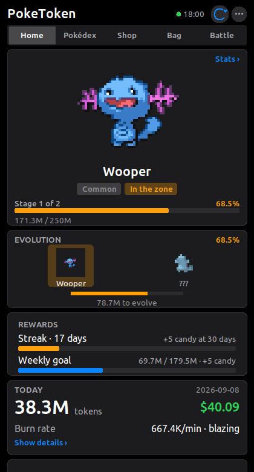

# poketoken-desktop

**Your Claude Code tokens, hatched into Pokémon — for WSL, Linux and Windows.**

A Python port of [PokeTokenBar](https://github.com/chattymin/PokeTokenBar) (macOS only) that
reads your local Claude Code logs, raises a Pokémon companion from the tokens you burn, and
shows it in a live, SwiftUI-styled window or in the terminal. Spend tokens, hatch an egg,
evolve it through its real evolution line, graduate it into your Pokédex, start again.

<p align="center">
  
  
  
  
</p>

> Unofficial, non-commercial Pokémon fan project. Sprites and species data come from
> [PokéAPI](https://pokeapi.co/) at runtime and are not bundled. See [License](#license--disclaimer).

## How it works

1. **Code as usual.** Every `assistant` turn in `~/.claude/projects/**/*.jsonl` carries token
   usage. poketoken reads those files (append-only, so refreshes are incremental) and dedups
   streamed messages on `(message.id, requestId)` keeping the largest total, like upstream.
2. **Hatch.** 5M tokens incubate an egg. The species is drawn from every Gen 1–5 base form,
   weighted by capture rate (commons often, a legendary about 1 in 129). One of 25 natures;
   1/64 shiny.
3. **Evolve.** It grows through its real PokéAPI evolution chain (1/2/3 stages, branching).
   A line always costs the same total for its rarity: 750M (common), 1.875B (uncommon),
   3B (rare), 6B (legendary) tokens.
4. **Graduate.** Final form + threshold archives it in the Pokédex and a fresh egg arrives.
5. **Shop & Bag.** Tokens you have used are your currency: Rare Candy (+100M growth), a Mint
   (re-roll nature), a Shiny Charm (1/64 → 1/48), or a new egg — plain, Uncommon+ or Rare+.

Only tokens used *after* install count. Progress lives in a JSON save on disk, so closing the
window, shutting down WSL or rebooting loses nothing.

## Install

Python 3.10+, Pillow and Tk. On WSL2 you need WSLg (Windows 11, or Windows 10 22H2+).

```bash
git clone https://github.com/haghfizzuddin/poketoken-desktop
cd poketoken-desktop
pip install --user pillow          # if missing;  sudo apt install python3-tk  if Tk is missing
scripts/install.sh                 # puts `poketoken` in ~/.local/bin
poketoken app
```

Or `pip install --user .` for a proper `poketoken` console script. Nothing is installed
system-wide and nothing phones home except PokéAPI for sprites and species data.

**Windows shortcut:** `scripts/windows/PokeToken.vbs` opens or closes the window from Windows
with no console flash. Create a shortcut to it and pin it to the taskbar or Start.
**Linux desktop entry:** copy `scripts/linux/poketoken.desktop` to `~/.local/share/applications/`.

## Commands

| command | what |
|---|---|
| `poketoken app` | open the live window (a second call brings the existing window to front) |
| `poketoken app --detach` | open it in the background and return to the shell |
| `poketoken close` | close the running window |
| `poketoken toggle` | open in the background, or close if it is open — what the shortcuts use |
| `poketoken pet` | the same window in its compact, companion-only view |
| `poketoken status` | one-shot status card in the terminal (also the default) |
| `poketoken watch -i 30` | live terminal view |
| `poketoken statusline` | one compact line for the Claude Code status line |
| `poketoken refresh` | a single refresh tick (cron / systemd timers) |
| `poketoken dex` · `shop` · `bag` | Pokédex, token shop (`--buy candy\|mint\|charm\|egg\|egg-uncommon\|egg-rare`), inventory (`--use candy\|mint`) |
| `poketoken notify on\|off\|test\|status` | desktop notifications for hatch / evolve / graduate / candy / egg |
| `poketoken debug` | scan roots, timings, raw save |

Window flags: `--dark` / `--light`, `--compact`, `-i SECONDS` (refresh, default 30).
Keys: `Esc` / `Ctrl-W` close, `Ctrl-R` refresh, right-click or `⋯` for the menu. Shop and Bag
buttons arm on the first click and fire on the second, so a stray click never spends tokens.

### Claude Code status line

`poketoken statusline` prints a line such as `⚡ Pikachu 2/3 41% │ 12.3M $4.1 │ 85.2K/min`.
Append its output to your status-line script and the companion lives in Claude Code's footer.
Every call is also a refresh tick, so the game advances even with the window closed.

## Where things live

`~/.local/share/poketoken/` (`%LOCALAPPDATA%\poketoken` on Windows; override with
`POKETOKEN_STATE_DIR`):

| path | what |
|---|---|
| `state.json` | the save — upstream's field names (`usedSinceInstall`, `eggUsage`, `active`, `dex`, …) |
| `events.log` | hatch / evolve / graduate / shop events and errors |
| `sprites/`, `cache/` | PokéAPI sprites and responses (species and lines forever, base index 30 days) |
| `ui.json`, `app.pid`, `app.log` | window size/appearance, running-instance pid, background log |
| `settings.json`, `notify.log` | notifications on/off, notification backend output |

Logs are read from `~/.claude/projects` and `~/.config/claude/projects`, or from
`CLAUDE_CONFIG_DIR` (comma-separated, `projects` appended) exactly like upstream.
`POKETOKEN_SCAN_ROOTS` adds extra roots.

Cost is priced per model from Anthropic's current rate card and, unlike upstream, splits cache
writes into the 5-minute (1.25×) and 1-hour (2×) TTLs the logs record.

## Platforms

| | status |
|---|---|
| WSL2 + WSLg (Windows 11) | tested — this is where it was built |
| Linux desktop (X11/Wayland with Tk) | same code path, expected to work |
| Native Windows (python.org build + Pillow) | code is Windows-aware (paths, process handling), **untested** |

WSLg cannot display borderless *override-redirect* windows, so upstream's floating desktop pet
has no direct equivalent here; the compact view is the stand-in.

### Desktop notifications

Hatch, evolve, graduate, Rare Candy grants and new eggs pop up as desktop notifications: through
`notify-send` where a Linux desktop has it, otherwise as a Windows toast via `powershell.exe`
(WSL and native Windows). Any refresh can fire one, so the window need not be open. Toggle with
`poketoken notify on|off` or the window menu; `poketoken notify test` sends a sample and reports
the backend. Output of the backend lands in `notify.log`.

## Not ported (yet)

Official 5-hour / weekly limit gauges and the Rare Candy grants they trigger (needs the
claude.ai limits API with your OAuth token), the other 11 CLI providers, the Ditto disguise,
save transfer. The save uses upstream's field names but is not
byte-compatible with the macOS app's Codable output.

## Development

```bash
python3 -m unittest discover -s tests -v      # offline, fake PokéAPI
python3 tests/audit_functions.py              # traces every function while exercising the whole app
```

The audit needs network and a display (and `python-xlib` for window captures). It runs the
tests, every CLI command, the PokéAPI fallbacks and a scripted walkthrough of the window, then
lists any function in the package that was never entered.

## License & disclaimer

MIT — see [LICENSE](LICENSE). Game balance, save-file field names and log-reading rules are
derived from [PokeTokenBar](https://github.com/chattymin/PokeTokenBar) by chattymin (MIT).

Pokémon and Pokémon character names are trademarks of Nintendo, Creatures Inc. and GAME FREAK
inc. This is an unofficial fan project with no affiliation or endorsement; it is not for sale
and bundles no Pokémon assets.
